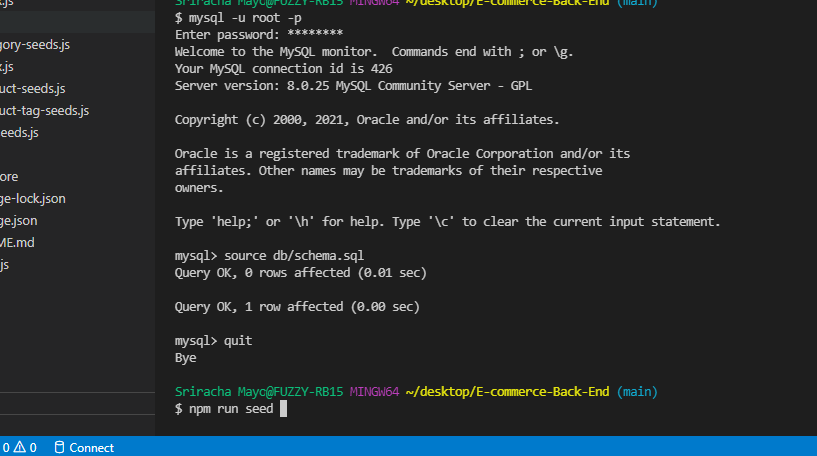
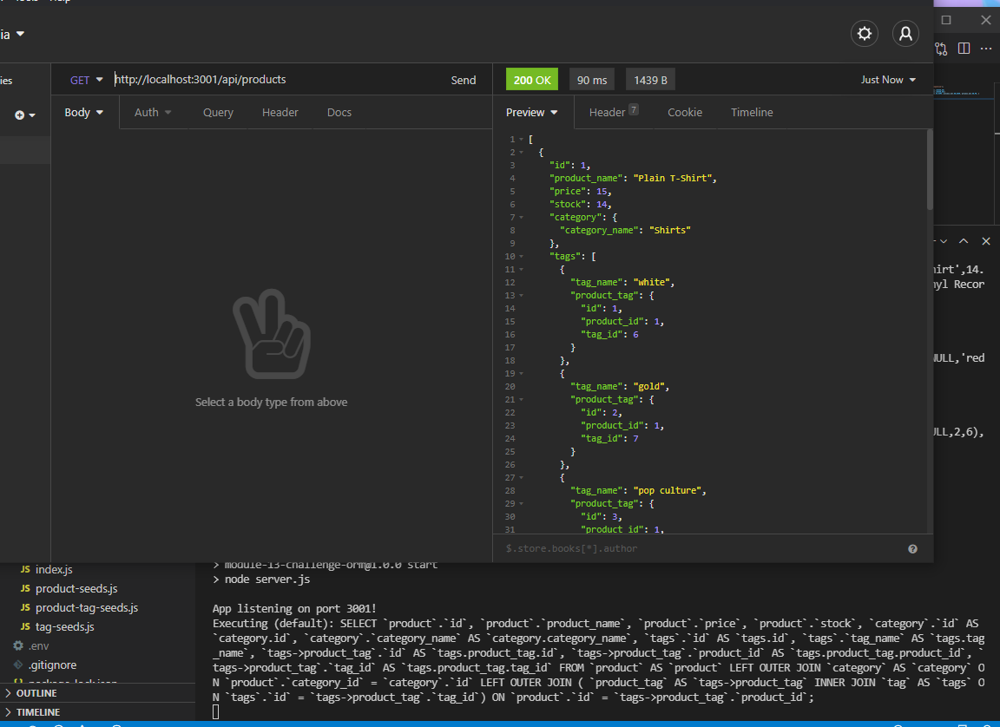
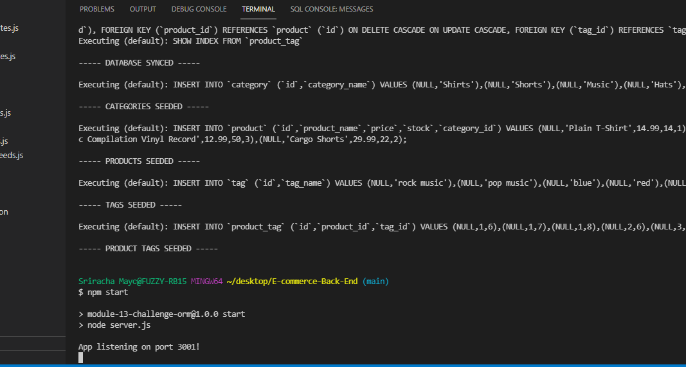

# E-commerce-Back-End
## About the e-commerce-back-end:

The purpose of this educational assignment was to practice object-relational mapping (ORM) with an e-commerce app, creating and interact with backend information stored in a database.

1. Present user with command line 
2. User runs 'mysql -u root -p', enters info, 'npm run seed' and 'npm start' to begin
3. User is able to connect to a database using sequelize
4. User is able to enter schema and seed commands, and database is created with test data
5. User models are synced to MySQL db when server is started
6. When the user tests routes in insomnia, data is displayed in JSON format
7. When the user tests GET, POST, PUT, and DELETE routes, data is manipulated in the database
8. User can go back to CLI, continue testing, or end

## Built With:

* Node
* Javascript
* MySQL / MySQL workbench

## Use:

User can create a team/employee info card list.

Install:
* npm init
* npm install mysql
* npm install sequelize 

Run:
* mysql -u root -p
* source db/schema.sql
* quit
* npm run seed
* npm start

*Used to learn, practice, test, understand, and implement various backend and database (MySQL) tools: 

* CRUD
* MySQL workbench and CLI shell
* Node.js built in function 'require' to load modules
* create and display routes 
* create and use models
* primary and foreign keys
* dotenv file 

## Contact:

* https://github.com/kitclong/E-commerce-Back-End
* https://youtu.be/

## Acknowledgments:

* npm
* MDN Web Docs
* w3schools
* Stackoverflow
* Freecodecamp
* Trilogy Education services
* local tutoring services
* Additional private tutoring 
